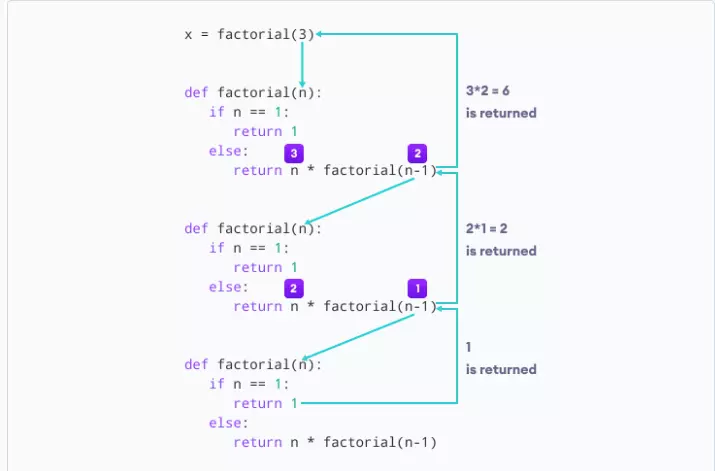

## Đệ Quy Là Gì?
Đệ quy là 1 hàm tự gọi lại chính nó

## Hàm Đệ Quy trong Python
Chúng ta biết rằng một hàm có thể gọi các hàm khác. Thậm chí có thể cho hàm tự gọi. Các loại cấu trúc này được gọi là các hàm đệ quy.
Hình ảnh sau đây cho thấy hoạt động của một hàm đệ quy được gọi là recurse


Demo: Gọi đẹ quy tính giai thừa
```py
def factorial(x):
    if x == 1:
        return 1
    else:
        return (x * factorial(x - 1))

num = 3
print(factorial(num))
```
Kết quả sẽ là:
```note
The factorial of 3 is 6
```
factorial() là một hàm đệ quy vì nó gọi chính nó.
Khi chúng ta gọi hàm này với số nguyên dương, nó sẽ gọi một cách đệ quy chính nó bằng cách giảm số.
```note
factorial(3)          # 1st call with 3
3 * factorial(2)      # 2nd call with 2
3 * 2 * factorial(1)  # 3rd call with 1
3 * 2 * 1             # return from 3rd call as number=1
3 * 2                 # return from 2nd call
6                     # return from 1st call
```
Dưới đây là một ảnh giải thích cụ thể từng bước cách xử lý hàm đệ quy:


## Lưu ý
Mọi hàm đệ quy phải có một điều kiện bắt buộc để dừng đệ quy nếu không  hàm nó sẽ gọi chính nó vô hạn
Theo mặc định depth tối đa đệ quy là <b>1000</b>. Nếu vượt qua giới hạn, nó dẫn đến lỗi Đệ quy <b>RecursionError</b>.
Dưới đây là ví dụ gây lỗi khi quá giới hạn depth.
```note
def recursor():
    recursor()
recursor()
```
Lỗi sẽ hiển thị như sau:
```note
Traceback (most recent call last):
  File "<string>", line 3, in <module>
  File "<string>", line 2, in a
  File "<string>", line 2, in a
  File "<string>", line 2, in a
  [Previous line repeated 996 more times]
RecursionError: maximum recursion depth exceeded
```
