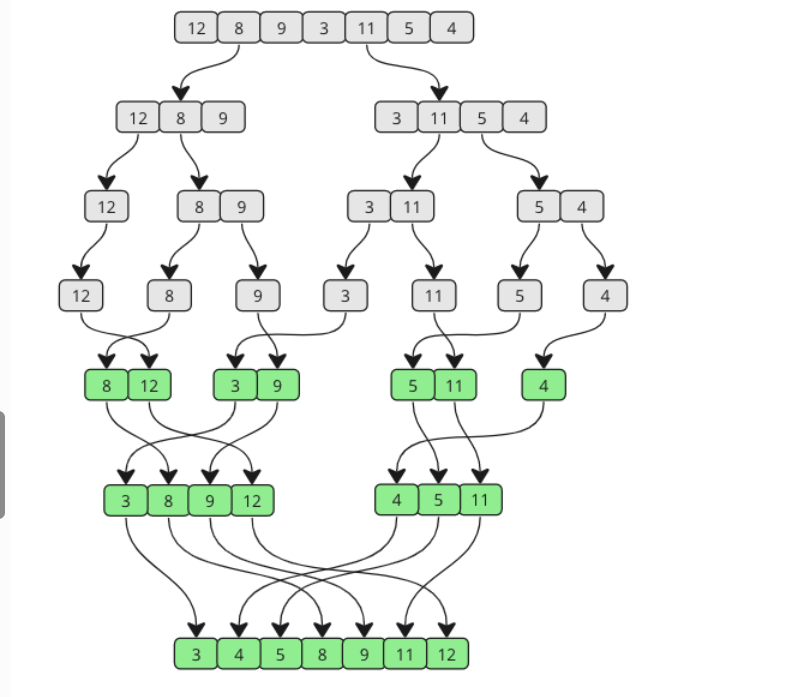

## Lí thuyết
Thuật toán sắp xếp trộn (MergerSort) là thuật toán chia để trị, sắp
xếp một mảng bắt đầu bằng cách chia nhỏ mảng thành các mảng nhỏ hơn,
sau đó ghép lại mảng đó theo đúng cách để sắp xếp

Cách hoạt động của nó:
1. Chia mảng chưa được sắp xếp thành hai mảng con, mỗi mảng có kích thước bằng một mảng đầu
2. Tiếp tục chia các mảng con miễn là phần tử hiện tại của mảng có nhiều hơn một phần tử
3. Gộp hai mảng con lại với nhau bằng cách luôn đặt giá trị thấp nhất lên trước
4. Tiếp tục hợp nhất cho đến khi không còn mảng con nào nữa

## Demo

Bước 1: Chúng ta bắt đầu chia mảng chưa được sắp xếp và chúng ta biết rằng nó sẽ chia đôi cho đến khi các mảng con chỉ còn một phần tử. Hàm mergersort sẽ tự gọi chính nó 2 lần một lần cho một nửa mảng. 
> [ 12, 8, 9, 3, 11, 5, 4]
> [ 12, 8, 9] [ 3, 11, 5, 4]
> [ 12] [ 8, 9] [ 3, 11, 5, 4]
> [ 12] [ 8] [ 9] [ 3, 11, 5, 4]

Bước 2: Việc chia mảng con đầu tiên hoàn tất bây giờ hợp nhất 8 và 9 2 phần tử đầu tiên được hợp nhất. 8 Giá trị thấp nhất nên đứng trước
> [ 12] [ 8, 9] [ 3, 11, 5, 4]

Bước 3: Các mảng con tiếp theo cần hợp nhất là [12] và [8, 9]. Các giá trị trong 2 mảng được so sánh ngay từ đầu. So sánh hợp nhất
> [ 8, 9, 12] [ 3, 11, 5, 4]

Bước 4: Tiếp theo chia mảng con thứ 2 như trên
....
Bước 8: Hai mảng con còn lại được hợp nhất. Hãy cùng xem xét chi tiết hơn cách thực hiện so sánh để tạo ra mảng đã hợp nhất và hoàn thiện:

3 nhỏ hơn 8:

Before [ 8, 9, 12] [ 3, 4, 5, 11]
After: [ 3, 8, 9, 12] [ 4, 5, 11]
Bước 9: 4 nhỏ hơn 8:

Before [ 3, 8, 9, 12] [ 4, 5, 11]
After: [ 3, 4, 8, 9, 12] [ 5, 11]
Bước 10: 5 nhỏ hơn 8:

Before [ 3, 4, 8, 9, 12] [ 5, 11]
After: [ 3, 4, 5, 8, 9, 12] [ 11]
Bước 11: 8 và 9 nhỏ hơn 11:

Before [ 3, 4, 5, 8, 9, 12] [ 11]
After: [ 3, 4, 5, 8, 9, 12] [ 11]

Bước 12: 11 nhỏ hơn 12:

Before [ 3, 4, 5, 8, 9, 12] [ 11]
After: [ 3, 4, 5, 8, 9, 11, 12]
