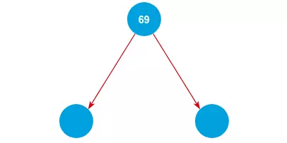

# Binary Tree
Một tree mà bao gồm nhiều nhất một phần tử con ở mỗi bên trái và phải được gọi là Cây nhị phân (Binary Tree). Mỗi phần tử con chỉ có thể có hai phần tử con. Nút con bên trái có giá trị nhỏ hơn, nút con bên phải có giá trị lớn hơn giá trị của nút cha.

## Implement a Binary Tree
Bài toán: Nhập một số bất kỳ và thêm chúng vào Cây nhị phân.

Thêm các chữ số vào cây mình sẽ tiếp tục thêm 2 số 39 và 79. Theo quy tắc "Nhỏ trái - Lớn Phải"

Duyệt Trung Thứ Tự: L -> N -> R
Duyệt Tiền Thứ Tự: N -> L -> R
Duyệt Hậu Thứ Tự: L -> R -> N

## Cây AVL
là cây nhị phân tìm kiếm cân bằng